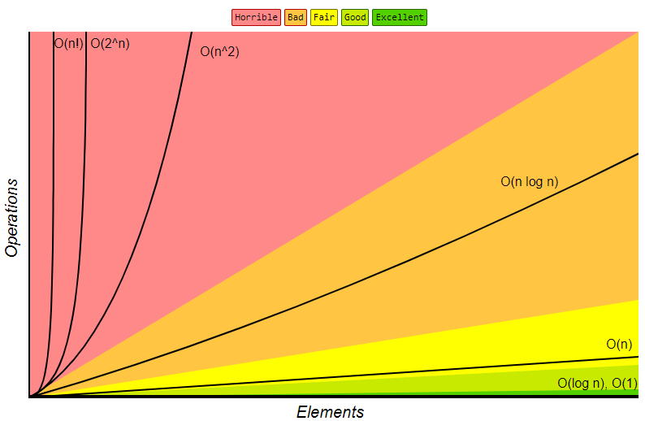

# CS50x-2020
My solutions and practice code for CS50x 2020 :bowtie:<br/>
jump to the [Resources](https://github.com/inspiringsource/CS50x-2020#additional-resourcesgift"📚")
## About this Repository

:point_right: This is my attempt at CS50 course. I will record relevant progress and source code for good practice. 

## Contents :speech_balloon:

README.md<br/>
  <details>
           <summary>Week 1 C</summary>
           <p> 
  ├── goodbye.c<br/>
  ├── hello.c<br/>
  ├── addtion.c<br/>
  ├── truncation.c<br/>
  ├── conditions.c<br/>
  ├── agree.c<br/>
  ├── meow.c<br/>
  ├── positive.c<br/>
  ├── mario.c<br/>
  ├── mario2.c<br/>
  ├── imprecision.c<br/>
  ├── cs50.c<br/>
  └── cs50.h<br/>
  </p>
    </details>
 <details>
           <summary>Week 2 Arrays</summary>
           <p> 
  ├── hello2.c<br/>
  ├── buggy0.c<br/>
  ├── buggy1.c<br/>
  ├── scores.c<br/>
  ├── brick.c<br/>
  ├── hi.c<br/>
  ├── string.c<br/>
  ├── uppercase.c<br/>
  ├── argv.c<br/>
  └── exit.c<br/>
  </p>
    </details>
 <details>
           <summary>Week 3 Algorithms</summary>
           <p> 
  ├── numbers.c<br/>
  ├── names.c<br/>
  ├── phonebook.c<br/>
  └── phonebook2.c<br/>
  </p>
    </details>

  <details>
           <summary>Week 4 Memory</summary>
           <p> 
  ├── address.c<br/>
  ├── address2.c<br/>
  ├── compare.c<br/>
  ├── copy.c<br/>
  ├── copy2.c<br/>
  ├── memory.c<br/>
  ├── swap.c<br/>
  ├── mario.c<br/>
  ├── scanf.c<br/>
  ├── scanf2.c<br/>
  ├── phonebook.c<br/>
  ├── phonebook.csv<br/>
  └── jpeg.c<br/>
  </p>
    </details>

  <details>
           <summary>Week 5 Data Structures</summary>
           <p> 
  ├── list.c<br/>
  ├── list2.c<br/>
  ├── list3.c<br/>
  └── list4.c<br/>
 
  </p>
    </details>

  <details>
           <summary>Week 6 Python</summary>
           <p> 
  ├── hello.py<br/>
  ├── hello2.py<br/>
  ├── blur.py<br/>
  ├── dictionary.py<br/>
  ├── addition.py<br/>
  ├── division.py<br/>
  ├── conditions.py<br/>
  ├── agree.py<br/>
  ├── meow.py<br/>
  ├── meow2.py<br/>
  ├── positive.py<br/>
  ├── mario.py<br/>
  ├── int.py<br/>  
  ├── scores.py<br/>
  ├── scores2.py<br/>
  ├── uppercase.py<br/>  
  ├── argv.py<br/>
  ├── exit.py<br/>
  ├── numbers.py<br/>
  ├── names.py<br/>
  ├── names2.py<br/>
  ├── phonebook.py<br/>
  ├── swap.py<br/>  
  ├── phonebook2.py<br/>
  └── hogwarts.py<br/>
  </p>
    </details>

  <details>
           <summary>Week 7 SQL</summary>
           <p> 
  ├── Favorite TV Shows - Form Responses 1.csv<br/>
  ├── favorites0.py<br/>
  ├── favorites1.py<br/>
  ├── favorites2.py (lambda)<br/>
  ├── favorites3.py<br/>
  ├── favorites4.py<br/>
  ├── favorites5.py (SQL)<br/>
  ├── shows.db<br/>
  └── Favorite TV Shows - Form Responses 1.csv<br/>
  </p>
    </details>

  <details>
           <summary>Week 8 HTML, CSS, JS</summary>
           <p> 
  ├── hello.py<br/>
  ├── __NAME__.py<br/>
  ├── __NAME__.py<br/>
  ├── __NAME__.py<br/>
  ├── __NAME__.py<br/>
  ├── __NAME__.py<br/>
  ├── __NAME__.py<br/>
  ├── __NAME__.py<br/>
  ├── __NAME__.py<br/>
  ├── __NAME__.py<br/>
  ├── __NAME__.py<br/>
  ├── __NAME__.py<br/>
  └── __NAME__.py<br/>
  </p>
    </details>

  <details>
           <summary>Week 9 Flask</summary>
           <p> 
  ├── hello.py<br/>
  ├── __NAME__.py<br/>
  ├── __NAME__.py<br/>
  ├── __NAME__.py<br/>
  ├── __NAME__.py<br/>
  ├── __NAME__.py<br/>
  ├── __NAME__.py<br/>
  ├── __NAME__.py<br/>
  ├── __NAME__.py<br/>
  ├── __NAME__.py<br/>
  ├── __NAME__.py<br/>
  ├── __NAME__.py<br/>
  └── __NAME__.py<br/>
  </p>
    </details>

  <details>
           <summary>Week 10 Ethics</summary>
           <p> 
  ├── hello.py<br/>
  ├── __NAME__.py<br/>
  ├── __NAME__.py<br/>
  ├── __NAME__.py<br/>
  ├── __NAME__.py<br/>
  ├── __NAME__.py<br/>
  ├── __NAME__.py<br/>
  ├── __NAME__.py<br/>
  ├── __NAME__.py<br/>
  ├── __NAME__.py<br/>
  ├── __NAME__.py<br/>
  ├── __NAME__.py<br/>
  └── __NAME__.py<br/>
  </p>
    </details>
<br/>
Final Project<br/>
<br/>

## Features :eyes:

Course link: https://cs50.harvard.edu/x/2021/

Compiling source code into machine code is made up of:
* preprocessing
* compiling
* assembling
* linking

All we have to be concerned about is compile the source code by using ```make``` or ```clang``` in the command line.

 
 ## Getting started :fire:

 C/C++ extensions are required for compiling and running CS50 C code:
 https://github.com/cs50/libcs50/releases

 To compile and execute the C code:
 ```bash
clang -o prog prog.c -lcs50
# and
./prog
```
CS50 Python library:
```
pip3 install cs50
```

## Arrays and Pointers :flashlight:
### Arrays

Let's say, for example, we declare an Array ```speed```

Declare an array:
```int speed[3] = {50, 80, 120};```
Printing the elements
```
for(int i = 0; i < 3; ++i) {
     printf("%d\n", speed[i]);
  }
```
### Pointers (Part A) :sparkles:
Pointers are used to store the addresses of an array.

We can declare a pointer variable called ptr
```int* ptr;```
Assign the address of speed[2]
```ptr = &speed[2];```

 Element      |Address       | Value        | 
------------- |------------- |------------- |
speed[0]      |0x7ffdceeb8e3c|   50         | 
speed[1]      |0x7ffdceeb8e40|   80         | 
speed[2]      |0x7ffdceeb8e44|   120        | 

if we print to the pointed value we use:
```printf("%d", *ptr);```
The output is 120

<ins>Example:</ins>
<table>
<tr>
<th>Code</th>
<th>Output</th>
</tr>
<tr>
<td>
<pre>
#include <stdio.h>

int main(void)
{
    int i, speed[3] = {50, 80, 120};

    printf("Element \t|\tAddress\t\t|\tValuen\n");

    for (i = 0; i < 3; i++)
    {
        printf("speed[%d]\t|\t%p\t|\t%d\n", i, &speed[i], speed[i]);
    }
}
</pre>
</td>
<td>

```
Element         |       Address         |       Valuen
speed[0]        |       0x7ffde513467c  |       50
speed[1]        |       0x7ffde5134680  |       80
speed[2]        |       0x7ffde5134684  |       120
```

</td>
</tr>
</table>

*Recall that addresses are binary numbers, but are often printed in hexadecimal base 16*

Pointers are discussed in detail in a subsequent section.

## Array of Arrays :pencil:

```string words[2]```<br/>

```words[0] = "HI!"```<br/>
```words[1] = "BYE"```<br/>

<ins>Example:</ins>
<table>
<tr>
<th>Code</th>
<th>Output</th>
</tr>
<tr>
<td>
<pre>
```
#include <cs50.h>
#include <stdio.h>
#include <string.h>

int main(void)
{
    string words[2];
    words[0] = "HI!";
    words[1] = "BYE";

    for (int n = 0; n < 2; n++)
    {
        for (int i = 0; i < 4; i++)
        {

            if (words[n][i] != '\0')
                printf("%c\t|\t", words[n][i]);
            else if (words[n][i] == '\0')
                printf("\\0\t|\t");
        }
    }
    printf("\n");
}
</pre>
</td>
<td>


```H       |       I       |       !       |       \0      |       B       |       Y       |       E       |       \0      |```


</td>
</tr>
</table>


*source: https://en.wikipedia.org/wiki/Big_O_notation*
## Recursion :repeat:

Recursion is the ability for a function to call itself. 


## Pointers (Part B) :telescope:

Pointers are variables that stores the addresses of other variables.

Pointers take up to 8 bytes. Excluding the variable we are actually pointing at. In the below example n variable takes an additional 4 bytes as a value of type int.

<ins>Example:</ins>
<table>
<tr>
<th>Code</th>
<th>Output</th>
</tr>
<tr>
<td>
<pre>
#include <stdio.h>

int main()
{
    int n = 50;  //create a value of 50 labeled n
    int *p = &n; //declare a variable, p, that has the type of *, a pointer

    printf("---------------\n->Variable n\n---------------\n");
    printf("%p\n", &n); //%p is the format code for an address and & operator get the address of the variable
    printf("%i\n", n);  //print out the value of n
    printf("---------------\n->Variable p\n---------------\n");
    printf("%p\n", p);
    printf("%i\n", *p); //* operator the dereference operator lets us “go to” the location that a pointer is pointing to
}
</pre>
</td>
<td>

```
---------------
->Variable n
---------------
0x7ffd5a2fd1bc
50
---------------
->Variable p
---------------
0x7ffd5a2fd1bc
50
```

</td>
</tr>
</table>

## Big O notation :milky_way:

Big O notation characterizes functions according to their growth rates.

In our case, measuring the complexity of an algorithm versus time.



<br> *Source: https://www.bigocheatsheet.com/*

## File I/O :open_file_folder:

```
#include <cs50.h>
#include <stdio.h>
#include <string.h>

int main(void)
{
    FILE *file = fopen("phonebook.csv", "a"); //see below for different modes
    if (file == NULL)
    {
        return 1;
    }

    char *name = get_string("Name: ");
    char *number = get_string("Number: ");

    fprintf(file, "%s,%s\n", name, number);

    fclose(file);
}
```
Mode  | Description
------------- | -------------
"r"       | Opens a file for reading. File must exist.
"w"       | Open for writing. Creates file.
"a"       | Open for append. File is created if it does not exist.
"r+"       | Open for reading and writing. File must exist.
"w+"       | Creates an empty file for reading and writing.
"a+"       | Opens a file for reading and appending.


[List of modes](https://www.programiz.com/c-programming/c-file-input-output "Link")

## Dynamic Memory Allocation :card_index_dividers:

When we need to change the size of a data structure like Array during the runtime, we can the following functions:

* malloc() allocates memory and returns a pointer that we save as n.
* realloc() reallocate some memory that we allocated earlier.
* free() The memory allocated using the above functions is de-allocate (freed). 


```
#include <stdio.h>
#include <stdlib.h>

int main(void)
{

    int *list = malloc(3 * sizeof(int));

    if (list == NULL)
    {
        return 1;
    }

    list[0] = 1; //list=1;
    list[1] = 2; //(list+1)=2;
    list[2] = 3; //(list+2)=3;
    // ^^ Same thing ^^

    //re-allocating more memory c

    int *tmp = realloc(list, 4 * sizeof(int));
    if (tmp == NULL)
    {
        free(list);
        return 1;
    }

    for (int i = 0; i < 3; i++)
    {
        tmp[i] = list[i];
    }
    tmp[3] = 4;

    list = tmp;

    for (int i = 0; i < 4; i++)
    {
        printf("%d\n", list[i]);
    }
    free(list);
}
```


Read more about [Dynamic Memory Allocation](https://www.programiz.com/c-programming/c-dynamic-memory-allocation "Link")

## SQL :card_file_box:

Relational databases are programs that store data with additional data structures that allow us to search and store data faster.<br/>
<br/>
Create, Read, Update and Delete (CRUD) is the acronym that refers to the four operations of persistent storage. 
<br/>

### Basic commands in SQL:
CREATE, INSERT<br/>
SELECT<br/>
```
SELECT column FROM table;
```
UPDATE<br/>
DELETE<br/>
<br/>
Examples:<br/>

```
sqlite> .mode csv
sqlite> .import 'Favorite TV Shows - Form Responses 1.csv' shows
```

```
sqlite> SELECT * FROM shows;
"10/19/2020 13:34:57","The Office",Comedy
"10/19/2020 13:35:03","The Office",Comedy
"10/19/2020 13:35:06","The Office","Comedy, Documentary, Reality-TV"
```
```
sqlite> SELECT title FROM shows;
"The Office"
"The Office "
Friends
```

For example, we can trim, sort, count and much more...
```
sqlite> SELECT UPPER(TRIM(title)), COUNT(title) FROM shows GROUP BY UPPER(TRIM(title)) ORDER BY COUNT(title) DESC;
```
To save data to SQL database ```sqlite> .save shows.db```


 Functions    |Types in SQL  | 
------------- |------------- |
AVG           |BLOB          | 
COUNT         |INTEGER       | 
DISTINCT      |NUMERIC       |
LOWER         |REAL          | 
MAX           |TEXT          | 
MIN           |              | 
UPPER         |              | 

Selecting a title, example code (SQL):
```SELECT * FROM imdb WHERE title="Toy Story 3";```

Lecture Notes: https://cs50.harvard.edu/x/2021/notes/7/#sql

## Additional resources:gift::

Big O notation: https://en.wikipedia.org/wiki/Big_O_notation
<br> &emsp; &emsp; &emsp; * https://youtu.be/QnRx6V8YQy0
<br> &emsp; &emsp; &emsp; * https://youtu.be/uHjPTUpQOAk

Operators in C: https://www.programiz.com/c-programming/c-operators

Dynamic Memory Allocation: https://www.geeksforgeeks.org/dynamic-memory-allocation-in-c-using-malloc-calloc-free-and-realloc/

Markdown cheatsheet https://github.com/tchapi/markdown-cheatsheet

Manual pages for C: https://manual.cs50.io/

Manual pages for Python: https://docs.python.org/3/library/index.html

In progress: https://youtu.be/5g0x2xv3aHU

This is from Harvard CS50 course material, lecture notes, source code and if not otherwise mentioned images.
